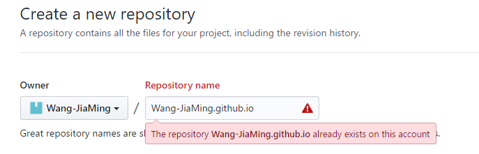

> 只有localhost看到我们得个人网站当然不是写博客的初衷，想在公网上看到我们生成的博客，首先我们我们的有一个github账号，和本地能运行git的环境。
<!--more-->
### 注册github账号
这部直接跳过了，注册[github](https://github.com/)流程可以自行百度。

### 创建一个仓库
该仓库的名字以自己github名字开头即可

由于我已有该仓库，所以提示已存在了。

### clone仓库到本地
把刚刚仓库的仓库clone到本地
```bash
git clone _gitUrl_
```

### 生成博客静态文件
回到刚刚初始化博客的目录，输入以下命令生成静态网站
```bash
hexo g
```
当命令跑完后，目录下会多出public文件夹，把该文件夹下所有文件复制到刚刚clone下来的本地仓库中，再提交到远程仓库中即可。

公网访问路径http://_yourName_.github.io，这时候你可以把网址分享给你的小伙伴看看了。(´▽`)