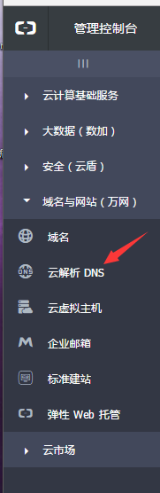
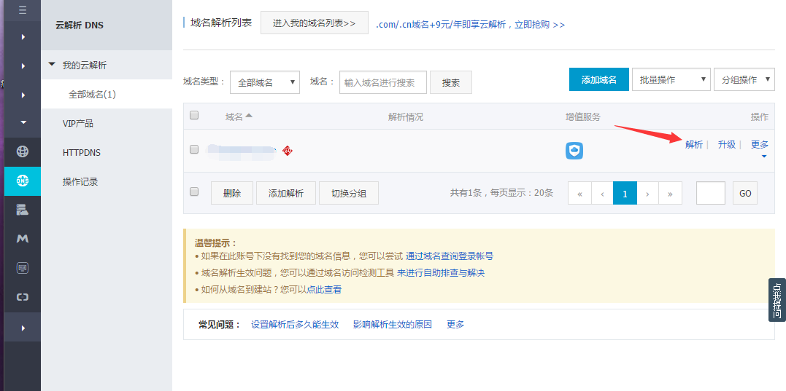
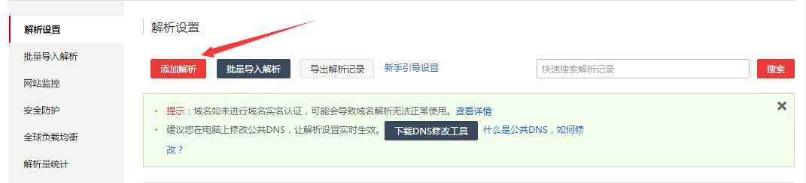
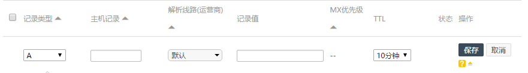
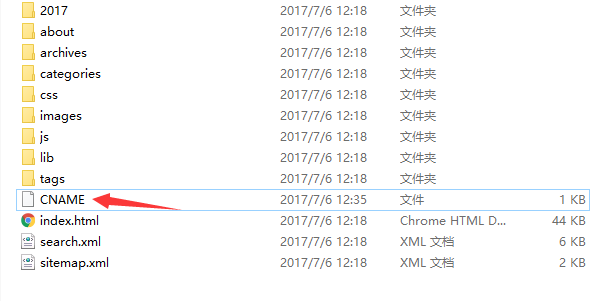
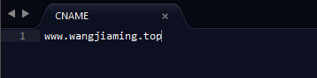

## 1. 购买阿里云的域名
首先需要注册个账号去阿里云购买域名，最近好像有搞活动，反正我新用户买.top首年一块钱哈。买了也不亏。

<!--more-->

## 2.解析
买了域名后开始在控制台配置dns解析

进入界面点解解析

添加解析

> 1.记录类型不变
> 2.主机记录填刚刚购买的域名
> 3.解析线路不变
> 4.记录值填xxxxx.github.io的ip【ps:可以用ping xxxxx.github.io查看ip】
> 5.剩余基本不变，点保存吧

这时候可能有点延时，过一阵子再打开你的域名吧！

几分钟过后...

什么？404？哈哈，这就对了！
## 3.CNAME文件
到最后一步了，在HEXO生成的public文件夹里放入CNAME文件，注意，不需要任何扩展名！
里面内容就一行，就是你的域名。这时候重新部署你的博客用域名进入试一试？

PS：CNAME放在Source文件夹下，这样每次hexo d就不用重新放到public了